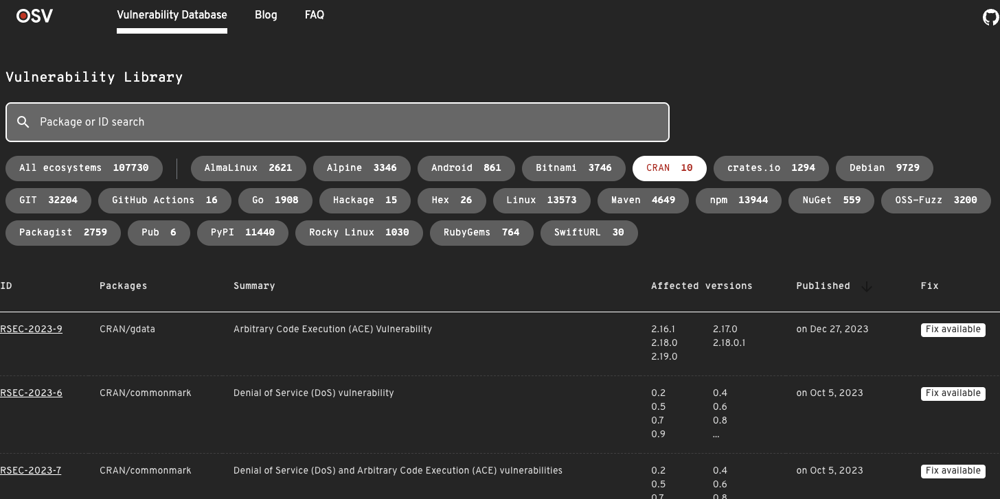

### Minutes Repositories WG
February 12, 2024
Recorded by Joseph Rickert

#### Attendees

* Gabe Becker
* Tyler Finethy - Posit
* Will Landau - Lilly
* Michael Lawrence - Genentech
* Jeroen Ooms - rOpenSci
* Lluís Revilla
* Joseph Rickert - ProCogia

The meeting was recorded and the [video](https://zoom.us/rec/share/7QkHEctqxlUyM3arP1fPkXfXg91qvc5NnkCWabjuxtBTocikiZQezbtoxjf6eHVr.Vt4tG02VVpKUV4ys?startTime=1707753767000) is available.

### R Advisory Data Base

Tyler Finethy presented the [R Advisory Database](https://github.com/rconsortium/r-advisory-database) which he began building last year.

* The slides from his presentation are available in the [Documents](https://github.com/RConsortium/r-repositories-wg/tree/main/Documents) folder of the GitHub repository
* The database is concerned with with vulnerabilities in R packages
* It contains the small number of know R vulnerabilities and is listed in the [OSV Vulneravility Database](https://osv.dev/list?ecosystem=CRAN)
* Note that this database is organized by repository and not by package.

* The WG agreed that the work of investigating vulnerabilities in R and taking steps to mitigate problems ought to be the purview of the working group in close cooperation with the R Foundation.
* The WG agreed that we ought to work closely with CRAN. At the very least an email should be sent to CRAN when a new vulnerability is registered.
* It is not clear where vulnerabilities to R itself would go, but R CORE gets confidential reports on vulnerabilities from time to time. (R is not included in the CRAN ecosystem.)
* A next step would be to publicize this work.
* We might ask CRAN to list vulnerabilities.
* Problems with publicizing:
  * Creating awareness without alarming people
  * Leading people to believe that packages with no vulnerabilities reported means that the packages have been looked at and do not contain any, when in fact the package have not yet been examined.

* The WG realizes that if we want people to contribute to finding vulnerabilities then we must provide guidelines. It was decided to go with the Python guidelines for now. Look [here](https://blog.pypi.org/)
* Python has had a number of problems over security the past couple of years 
* [PSF](https://www.python.org/psf-landing/) has hired a security engineer. Look [here](https://blog.pypi.org/posts/2023-08-04-pypi-hires-safety-engineer/)
* R is potentially vulnerable to a number of security issues
* Python has had known security problems for over a decade. It has taken this long to get traction.

**Actions**

* Alert CRAN about this effort
* Publicize the Advisory Database
* Follow the lead of the Python security efforts for now.
* Michael Lawrence to arrange a meeting with the R Foundation to discuss these issues.

### Collaboration with CRAN

* Kurt Hornik has invited Jeroen to visit in mid April
* A goal would be to try and containerize some CRAN processes

**Actions** 

* Jeroen will work with Kurt to set a date and provide JBR with an estimate for travel expenses
* JBR arrange funding for travel.

### Repositories

* What guidance can we give to groups such as the R Validation Hub who want to build a "CRAN Like" repository?
* Guidance should include organizational issues (such as management, package selection, operational transparency) in additional to technical guidance.
* The WG defines "CRAN Like" to mean a repository that operates on cohorts of packages, and checks the cohort with its dependencies.
* Jeroen noted that the R-universe works in this fashion. However, there was some discussion about whether R-Universe deploys and checks or checks and deploys.
* What does a set of "CRAN Like" packages look like in a "CRAN Like" repository?
* The Validation Hub may want to have first class snapshots with a multiple repositories relating to different submission branching out.

**Actions**

* JBR will ask the R Validation Hub to generate a set of requirements, even if they are only high level.
* JBR will invite the R Validation Hub sub group working on the repository to a Repositories WG meeting to discuss requirements.

