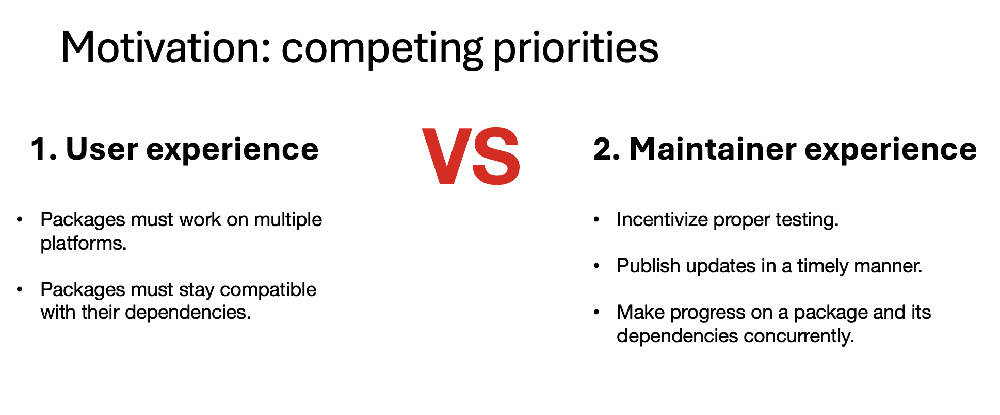

### Minutes Repositories WG
March 4, 2024
Recorded by Joseph Rickert

#### Attendees

* Gabe Becker
* Andrew Borgman - Biogen
* Tyler Finethy - Posit
* Wilmar Igl - Icon
* Will Landau - Lilly
* Michael Lawrence - Genentech
* Jeroen Ooms - rOpenSci
* Lluís Revilla
* Joseph Rickert - ProCogia
* Heather Turner - R Foundation

The meeting was recorded and the [video](https://zoom.us/rec/share/RGAGO8zHAzXTIK7bK0E0Y__V8b2DebEcZPH82kCmxpgiQYeyZE_GXSuCq1IiE1-E.SZ1MNWQNjGwid6uR?startTime=1709568222000) is available. It contains Will Landau's presentation of R-releases and captures the robust discussion that follows which includes implementation details and desirable features for "CRAN like" repositories. The discussion also touches on differences between CRAN and Bioconductor operations. Will presentation also provides a concise summaries of how r-universe works.

### R-releases

Will Landau previewed a prototype of a new community-curated repository of R package releases that he is developing with help from [Charlie Gao](https://github.com/shikokuchuo), Jeroen Ooms, and advice from contributors to [r-universe help](https://github.com/r-universe-org/help/issues/363).

* R-releases leverages R-universe to build, check, and deploy package releases from a one central package repository.
* Packages register once with R-releases, and then subsequent GitHub/GitLab releases automatically publish in R-universe. 
* Curation is decentralized, and package maintainers are in complete control of deployment.
* R-releases moves us further towards a production-grade CRAN-like repository. It will support modular functionality to monitor the health of packages and make it easier for downstream CRAN-like repositories to be developed.

The motivation for R-releases was to provides a workable balance between the competing priorities of the user experience vs maintainer experience.

Will's slides for his presentation are in the [Documents](https://github.com/RConsortium/r-repositories-wg/tree/main/Documents) directory of the working group repository and the GitHub repository for the project is located [here](https://github.com/r-releases).

## Next meeting

The next meeting of the working group will be on Monday, April 1, 2024 at 8AM PST. The plan is to discuss requirement for "CRAN like" repositories with members of the repositories workstream of the R Validation Hub.
